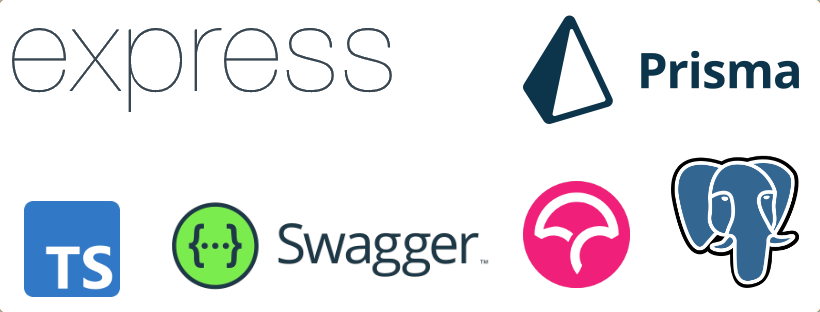

# TS REST API QUICK STARTER



## REQUIREMENTS 

- docker

## FEATURES

- Typescript
- Authorization with JWT in cookies
- Prisma ORM
- Postgres database
- Swagger
- Github action
- Codecov
- Tests with jest

## RUN

Fill .env file with your environment variables

```bash
docker-compose up -d
```

- You can now access api at http://localhost:${PORT}
- You can access swagger at http://localhost:${PORT}/api-docs
- You can access pgadmin at http://localhost:${PGADMIN_PORT}

## TEST

### With github action

You can setup github test automatically with codecov. You must create an account on codecov and create github action secret with CODECOV_TOKEN

### Locally

- You need node on your machine
- You must edit your .env file with your environment variables (change the database url to localhost and the database name to test for example)

```bash
docker-compose -f docker-compose.databse.yml up -d --build --force-recreate
npm install
npx prisma migrate dev --name init
npm run coverage
```

### Next steps

- Add more tests
- I'm currently working on a docker-compose for production